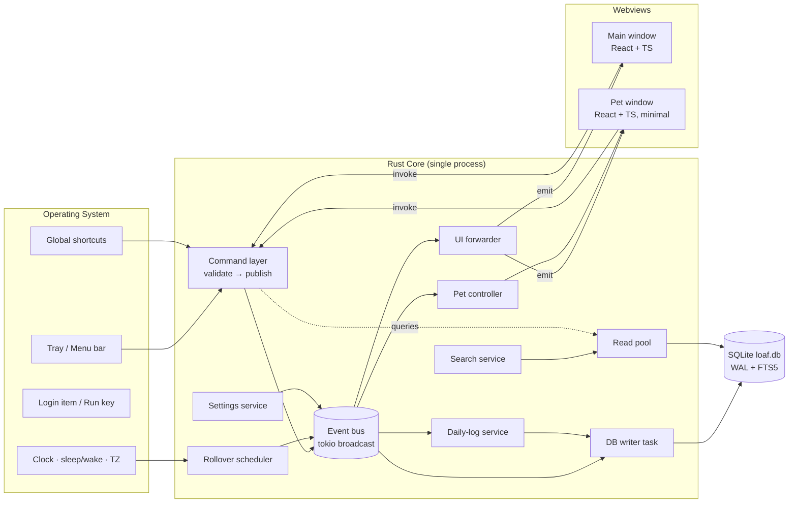

# Loaf — Technical Requirements Document (TRD)

**Milestone:** D3 · **Version:** 1.1 · **Date:** 2026-10-03 · **Status:** 🔒 LOCKED (approved 2026-10-03)
**Derives from:** PRD (D2 v1.1), ADR-001…014 (`01-build-principles/07-architecture-decisions.md`), budgets (`09-performance-budgets.md`)
**Schema:** `05-backend/backend-schema.md` (D6 v1.1)
**Changes in v1.1:** see §12.

This TRD defines **how** Phase 0 and Phase 1 are built: components, threads, events, IPC contracts, OS integration, and verification. It does not restate ADR rationale — it applies it.

---

## 1. System Architecture



### 1.1 Write path (every mutation)

```
UI action → invoke("note_update", payload)
  → Command handler: validate (pure fn, unit-tested)
  → send WriteRequest to DB writer (oneshot reply channel)
  → DB writer: BEGIN; write row(s); write task_events (if task); reindex search; COMMIT
  → DB writer publishes Event (e.g. NoteUpdated) on bus
  → UI forwarder emits to webviews → stores update → React re-renders
  → command returns the saved entity to caller
```

**Rule:** events are published **after commit**. No subscriber ever sees an event for data that isn't durable.

### 1.2 Read path

Queries (`notes_list`, `search`, `today_view`) bypass the bus: command → read connection → result. Reads never block writes (WAL).

## 2. Process & Thread Model

| Unit | Kind | Wakes on | Idle cost |
|------|------|----------|-----------|
| Tauri main thread | OS event loop | Window/tray/OS events | 0 |
| Tokio runtime | `current_thread` + small blocking pool | Commands, channel messages | 0 (parked) |
| DB writer | Dedicated OS thread, owns the write `rusqlite::Connection` | `mpsc` WriteRequest | 0 |
| Read pool | 2 connections behind a mutex, used via `spawn_blocking` | Query commands | 0 |
| Rollover scheduler | Tokio task awaiting a single `sleep_until(next_midnight)` + OS wake/TZ notifications | Midnight, resume, TZ change | 0 |
| Main webview | WebView2 / WKWebView process(es) | User input, events | Measured in V-2 |
| Pet webview | Separate window, static image in Phase 1 | Settings/visibility events | ~0 |

[Likely] A `current_thread` Tokio runtime is enough for Phase 1 load and minimizes idle threads; revisit only with measurements.

## 3. Event Catalog (Phase 0 + 1)

All events are variants of one `Event` enum (`core/events.rs`), `serde`-serializable, carrying `at: i64` (ms UTC). Names are past tense.

| Event | Payload (besides `at`) | Publisher | Subscribers |
|-------|------------------------|-----------|-------------|
| `AppStarted` | `version` | main | log service, pet |
| `AppReady` | `startup_ms` | main (frontend signal) | diagnostics |
| `AppShuttingDown` | — | tray Quit | DB writer (flush), all |
| `SettingChanged` | `key, value` | settings service | UI, pet, autostart, shortcuts |
| `NoteCreated` / `NoteUpdated` | `note` | DB writer | UI |
| `NoteDeleted` | `id` | DB writer | UI, tasks (unlink display) |
| `NotePinnedChanged` | `id, pinned` | DB writer | UI |
| `NoteArchivedChanged` | `id, archived` | DB writer | UI |
| `LabelsChanged` | `labels` | DB writer | UI |
| `TaskCreated` | `task` | DB writer | UI, log service |
| `TaskUpdated` | `task` | DB writer | UI |
| `TaskStatusChanged` | `id, from, to` | DB writer | UI, log service, *(Phase 3: pet)* |
| `TaskDeferred` | `id, from_date, to_date` | DB writer | UI, log service |
| `TaskDeleted` | `id` | DB writer | UI |
| `WorkUpdateAdded` / `WorkUpdateDeleted` | `task_id, update` | DB writer | UI |
| `MeetingCreated` / `MeetingUpdated` / `MeetingDeleted` | `meeting` / `id` | DB writer | UI |
| `ActionItemConverted` | `action_item_id, task_id` | DB writer | UI |
| `DayRolledOver` | `ended_date, new_date` | scheduler | log service, UI (Today refresh) |
| `DailyLogFrozen` | `log_date, reconstructed` | log service | UI |
| `PetVisibilityChanged` | `visible` | pet controller | tray menu label, UI |
| `PetMoved` | `display_id, x, y` | pet window | prefs (debounced 500 ms) |
| `DataExported` | `path, bytes` | data service | UI toast |
| `DataImported` | `counts` | data service | everything (full refresh) |
| `AllDataDeleted` | — | data service | everything (reset to first run) |
| `SearchIndexRebuilt` | `count, ms` | search service | UI |

**Lag handling:** subscribers use `broadcast::Receiver`; on `RecvError::Lagged(n)` they log a warning and resync from DB (UI forwarder emits `ResyncRequired`; frontend refetches the current view).

## 4. IPC Contract (Tauri Commands)

All commands return `Result<T, AppError>`; `AppError` serializes to `{ code, message, field? }`. Types are generated for TypeScript with `specta` (or `ts-rs`) so frontend and core can't drift.

### 4.1 Notes
| Command | Input | Output |
|---------|-------|--------|
| `note_create` | `{ title?, body?, color?, label_ids? }` | `Note` |
| `note_update` | `{ id, title?, body?, color?, label_ids? }` | `Note` |
| `note_set_pinned` | `{ id, pinned }` | `Note` |
| `note_set_archived` | `{ id, archived }` | `Note` |
| `note_delete` | `{ id }` | `()` |
| `note_restore_deleted` | `{ snapshot }` (undo within 5 s, held in frontend) | `Note` |
| `notes_list` | `{ archived, label_id?, sort }` | `NoteSummary[]` (title, 200-char excerpt, labels, color, pinned, edited_at) |
| `note_get` | `{ id }` | `Note` |
| `labels_list` / `label_create` / `label_rename` / `label_delete` | … | `Label[]` / `Label` / `Label` / `()` |

### 4.2 Tasks
| Command | Input | Output |
|---------|-------|--------|
| `task_create` | `{ title, description?, planned_date?, due_date?, priority?, project?, note_id? }` | `Task` |
| `task_update` | `{ id, …editable fields }` | `Task` |
| `task_transition` | `{ id, to }` | `Task` (rejects invalid transitions with `INVALID_TRANSITION`) |
| `task_defer` | `{ id, to_date }` | `Task` |
| `task_delete` | `{ id }` | `()` (only COMPLETED/CANCELLED) |
| `task_add_work_update` / `task_delete_work_update` | … | `WorkUpdate` / `()` |
| `tasks_query` | `{ view: today\|upcoming\|pending\|all\|completed, filters }` | `TaskSummary[]` |
| `task_get` | `{ id }` | `TaskDetail` (with updates, linked note, source meeting) |
| `task_history` | `{ id }` | `TaskEvent[]` |

### 4.3 Meetings
`meeting_create`, `meeting_update` (whole aggregate: participants, decisions, action items replaced atomically), `meeting_delete`, `meeting_get`, `meetings_list { participant?, from?, to? }`, `action_item_convert { action_item_id }` → `Task`, `participants_suggest { prefix }`.

### 4.4 Today, Daily Log, Search
| Command | Output |
|---------|--------|
| `today_view` | `{ date, greeting_part, yesterday_summary, planned, in_progress, overdue, pinned_notes, follow_ups }` |
| `daily_log_get { date }` | `DailyLog` (live if today, snapshot otherwise; `null` if no log) |
| `daily_logs_list { from, to }` | `{ date, completed, planned }[]` |
| `daily_log_export_md { date, path }` | `()` |
| `search { query, filters, sort, limit }` | `{ groups: { type, total, items: SearchHit[] }[] , ms }` |

### 4.5 Settings, Pet, Data, System
`settings_get_all`, `setting_set { key, value }`, `prefs_get { key }`, `prefs_set { key, value }`, `pet_set_visible`, `data_export { path }`, `data_import { path }`, `data_delete_all { confirm: "DELETE" }`, `search_rebuild`, `app_info`, `app_ready { startup_ms }`, `diagnostics_snapshot` (dev builds only).

## 5. Module Responsibilities

| Module | Owns | Must not |
|--------|------|----------|
| `events` | `Event` enum, bus handle, subscription helpers | Contain business logic |
| `commands` | Tauri command fns, input validation, mapping to services | Touch SQL directly |
| `domain` | Pure types + rules: `Note`, `Task`, state machine, validation | Do I/O |
| `db` | Connections, migrations (runner owns the transaction and `user_version`), repositories, write loop, search reindex | Publish events before commit; let a migration file open its own transaction |
| `search` | Query parsing, FTS query building, ranking, `reindex(entity)` called inside the caller's write transaction (ADR-014) | Mutate source data; reindex outside the source transaction |
| `daily_log` | Live computation, snapshot building, reconstruction, rollover handling | Depend on wall clock directly (uses `Clock` trait) |
| `scheduler` | Next-midnight timer, wake/TZ hooks → `DayRolledOver` | Poll |
| `settings` | Defaults, typed access, change events | Store secrets |
| `os` | Tray, autostart, global shortcuts, single instance, paths | Contain UI |
| `pet` | Pet window lifecycle, position persistence, (Phase 3) behavior engine | Render frames in Rust |
| `data` | Export/import/delete-all | Run while writes are in flight (takes writer lock) |

Folder layout is finalized in `08-code-organization.md` during CP1.

## 6. Key Technical Designs

### 6.1 Clock abstraction
`trait Clock { fn now_ms(&self) -> i64; fn local_date(&self, ms: i64) -> NaiveDate; fn tz(&self) -> Tz; }` — `SystemClock` in production, `FakeClock` in tests. Every date-dependent function takes `&dyn Clock`. This is required by `04-testing-strategy.md` (no sleeps; fake the clock).

### 6.2 Day rollover
1. On start: compute `next_local_midnight`; `sleep_until` it.
2. Also re-arm on: OS resume from sleep (Windows `WM_POWERBROADCAST`, macOS `NSWorkspaceDidWakeNotification`) and timezone change (Windows `WM_TIMECHANGE`, macOS `NSSystemTimeZoneDidChangeNotification`). [Likely] these are reachable through Tauri/tao window events or small platform shims; verify in CP1.
3. On fire: read `prefs.last_seen_date`; for every date from that day up to yesterday without a log → build snapshot (reconstructed=1 for days the app wasn't running) → insert; publish `DayRolledOver`; update `last_seen_date`.
4. Idempotent: `INSERT OR IGNORE`.

### 6.3 Autosave without per-keystroke writes
Frontend debounces 800 ms, plus flush on blur and on `beforeunload`. Core writes immediately on each `note_update` (it's user-initiated) — at human typing pauses this is a handful of writes per minute while active, zero while idle, satisfying the idle-write budget.

### 6.4 Markdown rendering
Rendered in the frontend with a small CommonMark library configured with **HTML disabled** and link `target` handling routed to the OS browser via Tauri `opener`. Candidate: `markdown-it` (~[Guessing] 100 KB min). Dependency rule (05) applies; measured in F1-11.

### 6.5 Global shortcuts
`tauri-plugin-global-shortcut`. Registration failures (already taken by another app) surface in Settings → Shortcuts with a conflict badge, never silently.

### 6.6 Single instance & autostart
`tauri-plugin-single-instance` (second launch → focus main); `tauri-plugin-autostart` (Windows Run key / macOS login item). Autostart launches with `--hidden`.

### 6.7 Pet window (Phase 1)
Frameless, transparent, `skipTaskbar`, `alwaysOnTop` per setting, `focus: false` on show (never steals focus). Content: one `` of the sprite, CSS opacity, size via window size. Drag via `data-tauri-drag-region`. On drag end → `PetMoved` (debounced). Off-screen recovery on `ScaleFactorChanged`/display removal.

### 6.8 Export / import / delete-all
- Export: take a read snapshot (single read transaction), stream JSON to file.
- Import: validate JSON shape + `format_version` + `schema_version ≤ current`; refuse if workspace not empty; insert all in one transaction with FKs; rebuild search; publish `DataImported`.
- Delete-all: stop writer, close connections, delete `loaf.db*` files, recreate empty DB via migrations, clear settings, publish `AllDataDeleted`, frontend routes to first-run.

### 6.9 Errors & logging
- `AppError` codes: `VALIDATION`, `NOT_FOUND`, `INVALID_TRANSITION`, `CONFLICT`, `DB`, `IO`, `INTERNAL`.
- `tracing` with a rolling file appender in the app-data `logs/` dir (5 × 2 MB). No log lines contain note/task content at `info` or above.
- Panics: caught by a panic hook → log + write `crash-<ts>.txt` locally; app attempts graceful flush.

## 7. Security & Privacy

| Requirement | Implementation |
|-------------|----------------|
| Zero network in Phase 0–1 | No HTTP client crate in the dependency tree; CSP `default-src 'self'`; Tauri capabilities allow only required plugins; verified by firewall test in release gate |
| Webview hardening | Tauri v2 capabilities per window: pet window gets only `pet_*`, `prefs_set`, `settings_get_all` |
| Content safety | Markdown HTML disabled; no `dangerouslySetInnerHTML` except the sanitized Markdown renderer output |
| File access | Only app-data dir + user-chosen export/import paths via OS dialog |
| Secrets | None in Phase 0–1. Keychain introduced in Phase 4 for the CI access token, reused for OAuth in Phase 5 (ADR-011, ADR-015) |

## 8. Frontend Architecture

- React 18 + TypeScript strict + Vite; two entry points: `main.html`, `pet.html`
- Routing: a small in-house router keyed by `view` state (Today, Notes, Note, Tasks, Task, Meetings, Meeting, Logs, Log, Archive, Settings) — no router dependency needed for a desktop app with no URLs
- State: per-feature stores (plain React context + reducer) hydrated by query commands, patched by forwarded events; no global state library (ADR-003)
- Styling: CSS variables for design tokens (UI/UX Brief §4), CSS modules per component
- Lists: virtualize only if a measured view exceeds the 300 ms budget at 5000 items

## 9. Build, CI, Release

| Item | Decision |
|------|----------|
| Repo | Monorepo: `src-tauri/` (Rust), `src/` (frontend), `docs/` |
| CI | GitHub Actions matrix `windows-latest`, `macos-latest` (+ `macos-13` Intel if available): fmt, clippy `-D warnings`, `cargo test`, `cargo llvm-cov`, `pnpm lint`, `pnpm test --coverage`, `tauri build` |
| Targets | Windows x64 + ARM64 (MSI/NSIS); macOS universal (Intel + Apple Silicon) DMG |
| Signing | Windows: unsigned for beta (SmartScreen warning documented); macOS: Developer ID + notarization required for testers outside dev — [Likely] needs a paid Apple Developer account, decision before CP5 |
| Versioning | SemVer, `0.x` until Phase 1 release = `1.0.0` |

## 10. Verification Tasks Mapped to Checkpoints

| ID (from 07) | Implemented in | Method |
|--------------|---------------|--------|
| V-1 macOS minimum | F0-01 | Build hello-world; run on oldest available macOS VM/hardware; record result |
| V-2 RAM total | F0-12 | Sum private bytes of all Loaf processes idle 10 min, both OSes |
| V-3 Pet idle CPU/GPU | F0-12 | Static pet window visible, 10 min idle profile |
| V-4 FTS5 at 5000 items | F0-12 | Seeded fixture, criterion bench, p95 |
| V-5 Event bus burst | F0-12 | 10,000 events/s synthetic burst, assert no loss, UI frame time |

## 11. Traceability (PRD → TRD)

| PRD | TRD section |
|-----|-------------|
| R0-01..R0-04 | §6.6, §3 `AppStarted` |
| R0-05..R0-06 | Schema §5, §6.9 |
| R0-07..R0-09 | §6.8 |
| R0-10, R1-40..R1-46 | §6.1, §6.2, Schema §3.7 |
| R1-01..R1-11 | §4.1, §6.3, §6.4 |
| R1-20..R1-29 | §4.2, Schema §3.3–3.5 |
| R1-30..R1-35 | §4.3 |
| R1-50..R1-56 | §4.4, Schema §3.8 |
| R1-60..R1-65 | §6.7 |
| R1-81 | §6.5 |
| NFR privacy | §7 |

## 12. Amendments

### Amendment D3-A1 (2026-10-03) — locked

No architecture changed; three clarifications so the TRD can't be read against the schema or the ADR log:

| § | Change |
|---|--------|
| Header | Derives-from now cites ADR-001…**014** (ADR-014 added) and D2/D6 v1.1 |
| §5 `db` | States that the **migration runner owns the transaction and `user_version`**, and adds "let a migration file open its own transaction" to the must-not column (Schema §5, Amendment D6-A1 #1) |
| §5 `search` | States that `reindex(entity)` runs **inside the caller's write transaction** per ADR-014, and must not run outside it — replacing any reading of ADR-006's trigger-based sync |

§3's event catalog is unchanged: `SearchIndexRebuilt` already covered the manual and startup rebuild paths that ADR-014's guardrails require.
