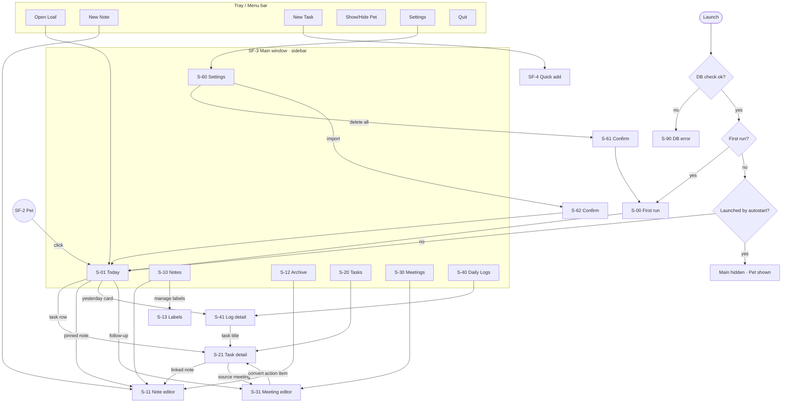

# Loaf — App Flow: Surfaces, Screens & Navigation

**Milestone:** D4 · **Version:** 1.2 · **Date:** 2026-10-03 · **Status:** 🔒 LOCKED (approved 2026-10-03)
**Derives from:** PRD (D2 v1.4) · **Feeds:** UI/UX Brief (D5), Implementation Plan (D7)
**Changes in v1.1:** §7 phase numbers reconciled with D0 Amendment D0-A1 (Integrations 5, Voice 6, Characters 7; order per ADR-015); no screen or flow changed. **v1.2:** S-50 Search and flow F-F withdrawn (D4-A2). **v1.3:** search, Bin and reminders restored by the owner (backend: migration 002); screens to be amended by the frontend work.

Scope: Phase 0 + Phase 1. Every screen has an ID (`S-xx`); every transition is listed. No screen may exist in code that isn't in this file.

---

## 1. Surfaces

Loaf has three surfaces. Only one of them is a "normal" window.

| ID | Surface | Always running? | Purpose |
|----|---------|-----------------|---------|
| **SF-1** | Tray / menu bar | Yes | Control surface while the main window is hidden |
| **SF-2** | Pet window | Yes, unless hidden | Presence; click to open Loaf |
| **SF-3** | Main window | Shown/hidden | The workspace (all screens below) |
| SF-4 | Quick-add popup | On global shortcut | Capture a task or note without opening the main window |

## 2. Screen Inventory

| ID | Screen | Type | Reached from | PRD |
|----|--------|------|--------------|-----|
| S-00 | First run | Full view (once) | First launch, after Delete-all | R1-71 |
| S-01 | **Today** (home) | View | Default view, pet click, sidebar | R1-70 |
| S-10 | Notes | View | Sidebar | R1-03 |
| S-11 | Note editor | Detail panel (right) / full | Note card, New note | R1-01..R1-11 |
| S-12 | Archive | View | Sidebar (bottom group) | R1-07 |
| S-13 | Labels manager | Modal | Notes view "Manage labels" | R1-08 |
| S-20 | Tasks | View with tabs: Today · Upcoming · Pending · All · Completed | Sidebar | R1-27 |
| S-21 | Task detail | Detail panel (right) | Task row | R1-20..R1-26 |
| S-30 | Meetings | View | Sidebar | R1-35 |
| S-31 | Meeting editor | Detail panel / full | Meeting row, New meeting | R1-30..R1-34 |
| S-40 | Daily Logs | View (calendar strip + list) | Sidebar | R1-44 |
| S-41 | Daily Log detail | Detail panel | Log row, Today "Yesterday" card | R1-41..R1-45 |
| S-50 | ~~Search~~ — **withdrawn (D4-A2, ADR-017)**. ID retired, not reused | — | — | R1-50..R1-56 removed |
| S-60 | Settings | View with sections: General · Pet · Shortcuts · Data · Advanced · About | Sidebar bottom, tray | R1-80 |
| S-61 | Delete-all confirm | Modal (type `DELETE`) | Settings › Data | R0-09 |
| S-62 | Import confirm | Modal | Settings › Data | R0-08 |
| S-90 | Error: DB check failed | Blocking view | Startup when `quick_check` fails | TRD §6.9 |

**Layout pattern:** sidebar (left, fixed) + list (center) + detail panel (right, opens on selection). On narrow windows (<1000 px) the detail panel becomes full-width with a Back button.

## 3. Navigation Map



## 4. Core Flows

### F-A · Morning start (D0 §7.1)
1. Login → Loaf autostarts hidden; pet appears (static)
2. If a day passed: rollover freezes yesterday's log
3. User clicks pet → main window opens on **Today**
4. Today shows yesterday summary card, planned tasks, overdue, in progress, pinned notes
5. User starts a task: row action **Start** → status IN_PROGRESS

### F-B · Capture a task without opening Loaf
1. Global shortcut `Ctrl/Cmd+Shift+T` → Quick-add popup (SF-4), focused
2. Type title, optional `!high` / `@tomorrow` tokens are **not** parsed in v1 (plain title only)
3. Enter → task created (planned today) → popup closes → toast-less (pet stays still in Phase 1)
4. Esc → closes without saving

### F-C · Write a note
1. `Ctrl/Cmd+N` (in app) or `Ctrl/Cmd+Shift+N` (global) → Note editor opens, title focused
2. Typing autosaves (800 ms pause / blur / close)
3. Labels and color via editor toolbar
4. Close panel → returns to previous view; empty note discarded

### F-D · Task lifecycle
`PLANNED —Start→ IN_PROGRESS —Pause→ PENDING —Resume→ IN_PROGRESS —Complete→ COMPLETED —Reopen→ PLANNED`
Available actions per state appear as buttons in the task row and detail (only valid transitions, PRD §6.2.1). Defer opens a date picker (Tomorrow · Next Monday · Pick date).

### F-E · Meeting → tasks
1. Meetings › New meeting → title, time (now), participants
2. During/after: notes, decisions, action items (+ assignee)
3. Each action item → **Convert to task** → task created; item shows a live status chip linking to it
4. Follow-up date set → appears on Today on that date

### F-F · ~~Find anything~~ — withdrawn (D4-A2)
There is no global search. To find something, open its sidebar view and use that view's filter: notes by label, tasks by status/priority/project/date, meetings by date and participant, logs by date. Letter F is retired so G and H keep their references.

### F-G · Review a past day
Sidebar › Daily Logs → pick date → log detail (sections + stats + Δ vs previous day) → Export as Markdown.

### F-H · Leave
Close button → window hides (first time only: one-time hint "Loaf keeps running in the tray"). Quit only from tray or `Ctrl/Cmd+Q`.

## 5. Tray Menu (SF-1)

```
Open Loaf                 
New Note           ⇧⌘N / Ctrl+Shift+N
New Task           ⇧⌘T / Ctrl+Shift+T
───────────────
Hide Pet / Show Pet  ⇧⌘P / Ctrl+Shift+P
───────────────
Settings…
Quit Loaf          ⌘Q / Ctrl+Q
```
Windows: left-click tray icon = Open Loaf; right-click = menu. macOS: click = menu (platform convention).

## 6. State Rules

| Rule | Detail |
|------|--------|
| Last view restored | Reopening the main window returns to the last view, **except** after a day rollover → Today |
| Unsaved work | There is none — autosave everywhere; closing panels never prompts |
| Detail panel + list sync | Edits in the panel update the list live (via events) |
| Deep links between entities | Always open in the detail panel of the target's home view, with Back returning to origin |
| Empty states | Every list view has a designed empty state (D5 §7) |
| Errors | Inline for validation, toast for operation failures, blocking only for S-90 |

## 7. Phase 2+ Placeholders (not built in Phase 1)

| Future screen | Phase | Sidebar position |
|---------------|-------|------------------|
| Dashboard (activity analytics) | 2 | Below Today |
| Browser Tabs | 2 | Inside Dashboard |
| Privacy Radar | 2 | Settings › Privacy |
| Pet behavior settings, Sleep | 3 | Settings › Pet |
| Integrations (MCP client + services) | 5 | Settings › Integrations |
| Voice | 6 | Global shortcut + pet |
| Characters / Closet | 7 | Settings › Pet › Characters |

Sidebar order is designed now so later items slot in without reshuffling muscle memory: **Today · (Dashboard) · Tasks · Notes · Meetings · Daily Logs · — · Archive · Settings**.

---

## 8. Amendments

### Amendment D4-A2 (2026-10-03) — search removed
S-50 (Search overlay), flow F-F, the tray "Search" item and the sidebar search box are withdrawn (ADR-017). IDs are retired, not reused. The `Ctrl/Cmd+Shift+K` and `Ctrl/Cmd+K` shortcuts are freed. Tray menu: Open Loaf · New Note · New Task · — · Hide/Show Pet · — · Settings · Quit.
