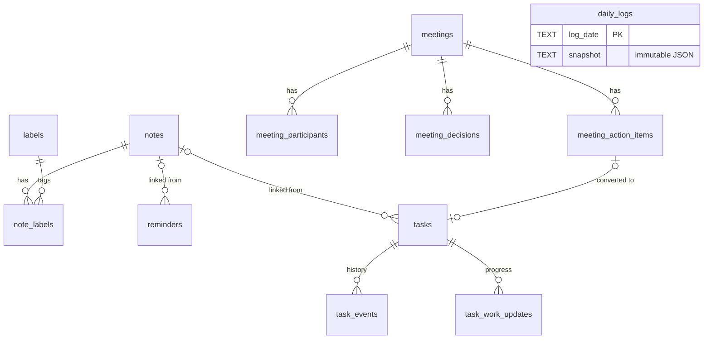

# Loaf — Backend Schema

**Milestone:** D6 · **Version:** 1.3 · **Date:** 2026-10-03 · **Status:** 🔒 LOCKED (approved 2026-10-03)
**Executable source of truth:** [`migrations/001_initial.sql`](migrations/001_initial.sql) then [`migrations/002_bin_and_reminders.sql`](migrations/002_bin_and_reminders.sql) — applied against SQLite 3.45.1 inside a runner-owned transaction (STRICT tables, triggers, constraints exercised).
**Derives from:** PRD (D2), TRD (D3), ADR-005/007
**Changes:** v1.1, v1.2 and v1.3 — see [§8 Amendments](#8-amendments).

---

## 1. Conventions

| Concern | Rule | Why |
|---------|------|-----|
| IDs | `TEXT` UUIDv7, generated in Rust | Time-sortable, safe to merge/export, no autoincrement leaks |
| Instants | `INTEGER` epoch **ms UTC**, suffix `_at` | Unambiguous, cheap to compare |
| Calendar days | `TEXT 'YYYY-MM-DD'` in **local** calendar, suffix `_date` | "Planned for Tuesday" is a local-calendar concept, not an instant |
| Booleans | `INTEGER 0/1` + `CHECK` | SQLite has no bool |
| Tables | `STRICT` | Type errors fail loudly |
| Enums | `TEXT` + `CHECK (x IN (...))` | Readable in exports, enforced in DB |
| Lists | Child tables, never JSON arrays | Queryable, indexable, FK-safe (deviation from D0 §5.1 "text array") |
| JSON | Only for `settings`, `user_preferences`, `daily_logs.snapshot` | These are documents, not relations |

**Connection PRAGMAs** (set by Rust on every open): `journal_mode=WAL`, `foreign_keys=ON`, `synchronous=NORMAL`, `busy_timeout=5000`. On startup: `PRAGMA quick_check`; on failure, the app refuses to write and offers restore from the latest `.bak`.

**Transaction ownership:** the migration runner wraps each migration file in one transaction and sets `PRAGMA user_version` itself. Migration files contain no `BEGIN`/`COMMIT` and no `user_version` write — see §5.

## 2. Entity-Relationship Diagram



## 3. Tables (Phase 0 + 1)

### 3.1 `settings` / `user_preferences`

| Table | Contains | Exported? | Example keys |
|-------|----------|-----------|--------------|
| `settings` | Things the user chose | Yes | `general.autostart`, `general.theme`, `general.font_size`, `pet.visible`, `pet.size`, `pet.opacity`, `pet.always_on_top`, `shortcuts.new_note`, `advanced.log_level` |
| `user_preferences` | Things the app remembers | Yes | `window.main.bounds`, `pet.position.<display_id>`, `ui.last_view`, `notes.sort` |

Values are JSON (`true`, `"dark"`, `{"x":1200,"y":800}`). Defaults live in Rust, not in rows — a missing key means default.

### 3.2 `notes`, `labels`, `note_labels`

| Column | Type | Notes |
|--------|------|-------|
| `title` | TEXT ≤200 | Empty allowed (body-only notes) |
| `body` | TEXT ≤100k | Markdown source |
| `color` | enum | `default, red, orange, yellow, green, teal, blue, purple, gray` (8 + default) |
| `pinned`, `archived` | 0/1 | Archived + pinned allowed; pin ignored while archived |
| `edited_at` | ms | Changes only when title/body/color/labels change, not on pin/archive |
| `deleted_at` | ms, NULL | v1.3 (002). Non-NULL = the note is in the Bin; label links are kept. Binned notes are hidden from list, search and label counts; `purge_expired` removes rows older than 30 days. |

Label names are unique **case-insensitively across the full Unicode range**, enforced by a unique index on `labels.name_folded`. `name` keeps the user's typed casing for display; `name_folded` is produced by Rust's Unicode lowercasing (`str::to_lowercase`) on every create and rename and is the only uniqueness key.

[Certain] `COLLATE NOCASE` was rejected for this: SQLite's built-in NOCASE collation folds ASCII `A–Z` only, so it treats `WORK`/`work` as duplicates but accepts `ÉCLAIR` alongside `Éclair`. Verified on SQLite 3.45.1 — a `name_folded` index rejects both.

Deleting a label cascades only the join rows.

### 3.2a `reminders` (v1.3, migration 002)

| Column | Notes |
|--------|-------|
| `id` | TEXT PK |
| `title` | TEXT, 1-200 chars |
| `remind_at` | ms (UTC). Past times are allowed and fire at once |
| `note_id` | Optional link to a note; `ON DELETE SET NULL` |
| `fired_at` | Set when `ReminderDue` was published (exactly once); cleared when `remind_at` changes |
| `done_at` | Set when the person marks it done |
| `created_at` | ms |

A partial index on `remind_at` (pending = not done, not fired) serves the scheduler's "next one" and "what is due" queries. Search stays plain `LIKE` (ADR-017); no search tables were added.

### 3.3 `tasks`

| Column | Notes |
|--------|-------|
| `status` | `PLANNED, IN_PROGRESS, PENDING, COMPLETED, CANCELLED` — transitions enforced in Rust (PRD §6.2.1); DB enforces `completed_at` consistency |
| `planned_date`, `due_date` | Local calendar dates |
| `started_at` | Set on first IN_PROGRESS; never cleared |
| `completed_at` | Set on COMPLETED; cleared on Reopen |
| `cancelled_at` | Set on CANCELLED; cleared on Reopen |
| `note_id` | `ON DELETE SET NULL` |
| `source_action_item_id` | Back-reference for "created from meeting"; not an FK to avoid a cycle |

### 3.4 `task_events` (append-only)

The **single source of truth for history**. Every create, status change, defer, and significant edit writes one row in the same transaction as the task change. A trigger blocks `UPDATE`. `local_date` is stored at write time so a later timezone change can't move history to a different day.

`kind` is one of `CREATED`, `STATUS`, `DEFERRED`, `EDITED`.

[Certain] **There is deliberately no `DELETED` kind.** `task_events.task_id` is `ON DELETE CASCADE`, so a row written to record a task's deletion is erased by that same deletion — the event could never be read back. Deletion is instead safe to lose because of two other rules: a task can only be deleted from `COMPLETED` or `CANCELLED` (PRD R1-29), and frozen daily logs copy task titles into their snapshot (§3.7), so a past day still reads correctly after the task is gone. If per-task deletion history is ever needed, it requires a separate non-cascading audit table and its own ADR — not a cascading event row.

Uses:
- Completion history view (R1-27 Completed)
- Daily log reconstruction for missed days (R1-43)
- Daily log stats ("tasks created today")

Deleting a task cascades its events. Already-frozen daily logs are unaffected because snapshots are self-contained.

### 3.5 `task_work_updates`

Append-only by product rule; deletion allowed within 5 minutes (enforced in Rust, not DB).

### 3.6 Meetings: `meetings`, `meeting_participants`, `meeting_decisions`, `meeting_action_items`

- Participants/decisions/action items are ordered by `position`.
- `meeting_action_items.task_id` is unique (one action item → at most one task) and `ON DELETE SET NULL` (deleting the task un-links, item remains).
- `transcript` exists now (nullable) so Phase 6 (Voice) needs no migration for it.

### 3.7 `daily_logs`

One row per past local day, **immutable** (UPDATE and DELETE blocked by triggers). Today's log is never stored.

Snapshot JSON, `snapshot_version = 1`:

```json
{
  "date": "2026-10-01",
  "planned":     [{"id":"…","title":"…","priority":"HIGH","status_at_eod":"COMPLETED"}],
  "in_progress": [{"id":"…","title":"…"}],
  "completed":   [{"id":"…","title":"…","completed_at":1759300000000}],
  "pending":     [{"id":"…","title":"…"}],
  "cancelled":   [{"id":"…","title":"…"}],
  "overdue":     [{"id":"…","title":"…","due_date":"2026-09-29"}],
  "stats": {
    "planned_count": 6, "completed_count": 4, "completion_ratio": 0.67,
    "tasks_created": 3, "notes_created": 2, "notes_edited": 5, "meetings": 1
  },
  "activity": null
}
```

`activity` stays `null` until Phase 2 (work sessions, app/browser time). Titles are copied into the snapshot so the log reads correctly even after tasks are renamed or deleted.

**Generation algorithm (rollover for day D):**
1. Tasks with `planned_date = D` → `planned` (with their status as of end of D, derived from `task_events` ≤ end of D)
2. Status as of end of D derived per task from the last `task_events` row with `local_date ≤ D`
3. `completed` = STATUS events to COMPLETED with `local_date = D` (and not reopened the same day)
4. `overdue` = `due_date < D` and status at end of D not COMPLETED/CANCELLED
5. Skip insert if all lists are empty and all counts are zero (R1-43)
6. `INSERT OR IGNORE` — rollover is idempotent

### 3.8 Search — ❌ REMOVED (ADR-017)

Global search was withdrawn on 2026-10-03. Migration 001 creates no FTS5 table, no `search_map`, and no reindex hooks; repositories write source rows only. Section number kept so references to §3.9+ do not shift.

If search is ever reinstated it arrives as migration 00N that creates the index and backfills it in one pass from the source tables, and the discipline from ADR-014 (reindex inside the source transaction, consistency test, rebuild command) returns with it.

## 4. Phase 2 Preview (migration 002 — not created yet)

Defined now so Phase 1 doesn't paint us into a corner; created only when Phase 2 starts.

| Table | Purpose | Key columns |
|-------|---------|-------------|
| `app_sessions` | Foreground app time | `app_id`, `app_name`, `category`, `started_at`, `ended_at`, `duration_ms` |
| `browser_sessions` | Browser window focus time | `browser`, `window_id`, `started_at`, `ended_at` |
| `browser_tabs` | Tab lifecycle | `browser_session_id`, `tab_id`, `title`, `domain`, `url` (nullable, opt-in), `opened_at`, `closed_at`, `focused_ms` |
| `domains` | Category + tracking flag | `domain` UNIQUE, `category`, `tracked`, `first_seen_at`, `last_seen_at` |

Rules carried forward: writes buffered and flushed ≤1/min (ADR-005); untracked domains never written; incognito never written.

## 5. Migration Policy (ADR-007)

- Files: `NNN_description.sql`, embedded in the binary, applied in order
- **The runner owns the transaction.** It issues `BEGIN`, executes the file, sets `PRAGMA user_version`, then `COMMIT`. A migration file must contain neither statement: [Certain] a `BEGIN` inside the runner's transaction fails with `cannot start a transaction within a transaction` (verified on SQLite 3.45.1), and a `user_version` written by the file can drift from the runner's bookkeeping.
- **Lint rule (implemented in F0-04 as `validate_chain`).** Run the migration chain from scratch on a scratch database, each file inside an outer transaction, exactly as the runner does. Reject a file if it errors with "within a transaction" (it opened its own), if the transaction is gone afterwards (`COMMIT`/`END`/`ROLLBACK`), or if `user_version` is non-zero (it wrote the version); also reject version gaps. Executing the file is exact where a text search is not: `CREATE TRIGGER … BEGIN … END;` bodies contain the same keywords, including a bare `END;` line in a multi-line trigger, which the regex originally documented here would have wrongly flagged.
- Version in `PRAGMA user_version`, set by the runner only
- Before applying: copy DB to `loaf.db.bak-<from_version>`; keep last 3 backups
- Forward-only; a broken migration is fixed by a new migration
- Every migration has a test: build DB at previous version with fixture data → migrate → assert data intact

## 6. Size Estimate (1 year, heavy use)

| Data | Volume | Approx. size |
|------|--------|--------------|
| Notes | 2,000 × 2 KB | 4 MB |
| Tasks + events + updates | 5,000 tasks, 25,000 events | 6 MB |
| Meetings | 500 × 4 KB | 2 MB |
| Daily logs | 365 × 6 KB | 2 MB |
| **Phase 1 total** | | **~14 MB** [Likely] |

Phase 2 activity data is the real growth risk; its PRD addendum must define retention (e.g., raw tab events 90 days, daily aggregates forever) to stay under the 100 MB target.

## 7. Export Format

```json
{
  "format": "loaf-export",
  "format_version": 1,
  "schema_version": 1,
  "exported_at": 1759400000000,
  "app_version": "0.1.0",
  "data": {
    "settings": [...], "user_preferences": [...],
    "notes": [...], "labels": [...], "note_labels": [...],
    "tasks": [...], "task_events": [...], "task_work_updates": [...],
    "meetings": [...], "meeting_participants": [...],
    "meeting_decisions": [...], "meeting_action_items": [...],
    "daily_logs": [...]
  }
}
```

`labels` rows carry both `name` and `name_folded`; import recomputes `name_folded` from `name` rather than trusting the file, so an export edited by hand cannot smuggle in a duplicate label.

---

## 8. Amendments

### Amendment D6-A1 (2026-10-03) — locked with four corrections

Applied before lock, after a cross-document consistency review. Schema version stays `1`; no product code exists yet, so `001_initial.sql` was corrected in place rather than superseded by a `002`.

| # | Was | Now | Why |
|---|-----|-----|-----|
| 1 | `001_initial.sql` wrapped itself in `BEGIN;…COMMIT;` and set `PRAGMA user_version = 1` | Both removed; runner owns the transaction and the version (§1, §5) | [Certain] ADR-007 has the runner open a transaction per migration; the file's own `BEGIN` fails inside it (reproduced on SQLite 3.45.1) |
| 2 | `task_events.kind` allowed `'DELETED'` | Kind removed from the `CHECK` (§3.4) | [Certain] `task_id` cascades, so the row recording a deletion is destroyed by that deletion — the state was unreachable |
| 3 | "Label names are unique case-insensitively", enforced by `UNIQUE INDEX … COLLATE NOCASE` | `labels.name_folded` column + unique index; Rust does Unicode lowercasing (§3.2) | [Certain] NOCASE folds ASCII only, so the stated guarantee did not hold for non-ASCII names |
| 4 | §3.8 rejected triggers while ADR-006 (locked) mandated them | §3.8 cites ADR-014, which supersedes ADR-006 on the sync mechanism | ADR-006 could not be edited silently; a locked decision needs a superseding ADR |

### Amendment D6-A2 (2026-10-03) — comment only
The `meetings.transcript` comment in `001_initial.sql` and §3.6 now say Phase 6 (Voice), per ADR-015. No column, constraint or schema version changed.

### Amendment D6-A3 (2026-10-03) — search tables removed
Per ADR-017, `001_initial.sql` no longer creates `search_index` (FTS5) or `search_map`, and §3.8, the ER diagram entry, the FTS size row (Phase 1 total ~26 → ~14 MB [Likely]) and the export note are updated. Schema version stays `1`: no code or user database exists, so the file is edited in place rather than superseded by a `002`. Nothing else in the schema changed; the 3 triggers, `name_folded` and the cascade rules are untouched.

### Amendment D6-A4 (v1.3) — search, Bin and reminders restored by the owner
Migration `002_bin_and_reminders.sql` adds `notes.deleted_at` (Bin, 30-day retention) and the `reminders` table. Notes search is a plain case-insensitive substring match; ADR-017 (no search tables) is unchanged. Schema version is now `2`; export format gains `reminders` and `notes.deleted_at` when export is built.
