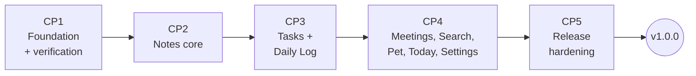

# Loaf — Implementation Plan (Phase 0 + Phase 1)

**Milestone:** D7 · **Version:** 1.1 · **Date:** 2026-10-03 · **Status:** 🔒 LOCKED (approved 2026-10-03)
**Derives from:** PRD (D2 v1.1), TRD (D3 v1.1), App Flow (D4 v1.1), UI/UX Brief (D5 v1.1), Schema (D6 v1.1), Build Principles (D1)
**Changes in v1.1:** CP1 kickoff checklist item 1 discharged (PRD §9 approved 2026-10-03); F0-04 and F1-20 acceptance tightened to cover Schema Amendment D6-A1 and ADR-014.

This plan supersedes the *starting* feature list in `06-feature-definition.md` (which said the plan would finalize it). Feature IDs below are final.

---

## 1. How to Read This Plan

No calendar weeks or dates. 40 features (`F0-xx`, `F1-xx`) are ordered into five checkpoints, each strictly dependent on the one before it. A checkpoint is **done when its exit gate passes**, not when a date arrives.

Each feature still carries a **day estimate**, kept for a different purpose than scheduling: it is the relative-sizing signal that enforces the ≤3-day rule from `06-feature-definition.md`, and it is what the cut order (PRD §11) and the risk register (§10) are reasoned against. Treat the numbers as **relative size**, not a forecast — a "2.0" feature is roughly twice a "1.0" feature, nothing more.

| Block | Features | Relative size (dev-days) |
|-------|---------:|--------------------------:|
| CP1 Foundation + verification | 13 | 20.0 |
| CP2 Notes core | 9 | 10.0 |
| CP3 Tasks + Daily Log | 7 | 13.0 |
| CP4 Meetings, Search, Pet, Today, Settings | 10 | 16.5 |
| CP5 Release hardening | 1 | 3.0 |
| **Total** | **40** | **62.5** |

[Likely] This is still roughly 2–3× the scope the originally-locked `02-build-order.md` week numbers implied — that document's phase durations are stale and should be read as **non-authoritative** until replaced by the per-phase re-estimate this plan requires before each phase starts (see `02-build-order.md` §Amendments).

## 2. Checkpoint Overview



Strictly sequential — each checkpoint's features depend on the previous checkpoint's exit gate, not on each other's dates.

| Checkpoint | Exit gate (the only thing that moves you to the next checkpoint) |
|------------|---------------------------------------------------------------------|
| **CP1** | All F0 acceptance criteria pass on Win + macOS · V-1…V-5 recorded in 07/09 · `08`, `10`, `11` written and locked · CI green |
| **CP2** | Notes usable end-to-end, restart-safe, both OSes, coverage ≥80% on touched modules |
| **CP3** | Task lifecycle + daily log freeze verified with fake-clock tests across midnight, DST, TZ change, multi-day gap |
| **CP4** | Search p95 <500 ms at 5000 items · pet present · Today complete · all PRD R1 requirements implemented |
| **CP5** | `02` shipping checklist + `09` release profile pass on both OSes → tag `v1.0.0` |

## 3. CP1 — Foundation (Phase 0)

Order matters: each feature depends only on those above it.

| ID | Feature | Days | Depends | Acceptance (summary) |
|----|---------|-----:|---------|----------------------|
| F0-01 | Tauri v2 + React/TS/Vite scaffold; builds on Win + macOS; **V-1** | 1.5 | — | Signed-off dev build runs on both OSes; oldest macOS result recorded |
| F0-02 | CI matrix (fmt, clippy, tests, coverage, build) | 1.0 | F0-01 | PR runs green on `windows-latest` + `macos-latest` |
| F0-13 | Error model (`AppError`), `tracing` logs, panic hook | 1.0 | F0-01 | Errors serialize to `{code,message}`; crash file written locally |
| F0-03 | Event enum + broadcast bus + lag handling | 1.5 | F0-13 | Unit tests: publish/subscribe, lag → resync path |
| F0-04 | DB open, PRAGMAs, migration runner, backup-before-migrate, `quick_check`, migration 001 | 1.5 | F0-13 | Fresh DB at OS path; **runner owns the transaction and sets `user_version=1`**; lint rejects a migration file that opens its own transaction or writes `user_version` (Schema §5 regex — must not false-positive on `CREATE TRIGGER … BEGIN … END`); failed migration leaves original intact (test) |
| F0-05 | DB writer thread, WriteRequest/oneshot, publish-after-commit | 1.5 | F0-03, F0-04 | Integration test: event never observed before commit |
| F0-06 | `Clock` trait + rollover scheduler (midnight, wake, TZ) | 2.0 | F0-03 | Fake-clock tests: midnight, DST, TZ change, sleep across midnight |
| F0-07 | Settings + preferences services, IPC, TS type generation | 1.5 | F0-05 | `SettingChanged` round-trip UI↔core; defaults when key missing |
| F0-08 | Tray/menu bar, single instance, close-hides, quit | 1.0 | F0-07 | R0-01..R0-03 on both OSes |
| F0-09 | Autostart with `--hidden` | 0.5 | F0-08 | R0-04 on both OSes |
| F0-10 | Frontend shell: sidebar, view router, design tokens, theme, contrast check | 2.0 | F0-07 | R0-11; token pairs pass AA (automated contrast test) |
| F0-11 | Export / import (empty workspace) / delete-all | 2.5 | F0-05, F0-10 | R0-07..R0-09; export→delete→import round-trip identical |
| F0-12 | Perf harness: 5000-item fixture, criterion benches, idle profiler scripts; **V-2…V-5** | 2.5 | F0-11 | Results appended to 07 (Phase 0 verification) and 09 (baselines) |
| | **CP1 total** | **20.0** | | |

**CP1 decision point (after F0-12):** if V-2 (RAM) fails, stop and write a new ADR before CP2 — options are re-defining the budget, trimming webview features, or reconsidering the shell. No Phase 1 code until resolved.

## 4. CP2 — Notes Core

| ID | Feature | Days | Depends | PRD |
|----|---------|-----:|---------|-----|
| F1-01 | Create note + editor panel + autosave (800 ms / blur / close) | 2.0 | CP1 | R1-01, R1-02 |
| F1-02 | Notes list: pinned/others, cards, sort | 1.5 | F1-01 | R1-03 |
| F1-03 | Edit semantics: `edited_at` rules, reopen restores | 0.5 | F1-01 | R1-04 |
| F1-04 | Delete with 5 s undo | 1.0 | F1-02 | R1-05 |
| F1-05 | Pin / unpin | 0.5 | F1-02 | R1-06 |
| F1-06 | Archive / restore + Archive view | 1.0 | F1-02 | R1-07 |
| F1-07 | Labels: add/remove/autocomplete, sidebar filter, manager; Unicode-folded uniqueness (Schema §3.2) | 2.0 | F1-02 | R1-08, R1-09 |
| F1-08 | Note color | 0.5 | F1-01 | R1-10 |
| F1-09 | Markdown Edit/Preview (HTML disabled) | 1.0 | F1-01 | R1-11 |
| | **CP2 total** | **10.0** | | |

Note: search indexing for notes is written in F1-01 (repository calls `reindex`), but the search **UI** comes in CP4.

## 5. CP3 — Tasks & Daily Log

| ID | Feature | Days | Depends | PRD |
|----|---------|-----:|---------|-----|
| F1-10 | Create task + quick add (Today/Tasks) | 1.5 | CP2 | R1-20, R1-21 |
| F1-11 | State machine (pure, exhaustive tests) + `task_events` + transition UI | 2.0 | F1-10 | R1-22, R1-23 |
| F1-12 | Dates, priority, project, overdue badge, defer | 1.5 | F1-11 | R1-24, R1-28 |
| F1-13 | Task detail: work updates, link note, history, delete rule | 1.5 | F1-11 | R1-25, R1-26, R1-29 |
| F1-14 | Task views: Today/Upcoming/Pending/All/Completed + filters | 2.0 | F1-12 | R1-27 |
| F1-15 | Daily log: live compute, snapshot at rollover, missed-day reconstruction, immutability | 3.0 | F1-11, F0-06 | R1-40..R1-43, R1-46 |
| F1-16 | Daily Logs view + detail + compare + Markdown export | 1.5 | F1-15 | R1-44, R1-45 |
| | **CP3 total** | **13.0** | | |

F1-15 test matrix (all with `FakeClock`): normal midnight · app closed 3 days · sleep across midnight · DST forward/back · TZ change mid-day · task completed then reopened same day · task deleted after snapshot.

## 6. CP4 — Meetings, Search, Pet, Today, Settings

| ID | Feature | Days | Depends | PRD |
|----|---------|-----:|---------|-----|
| F1-17 | Meeting create/edit (aggregate save) + participants + autocomplete | 2.0 | CP3 | R1-30, R1-31, R1-35 |
| F1-18 | Decisions + action items (ordered lists) | 1.0 | F1-17 | R1-32, R1-33 |
| F1-19 | Convert action item → task (+ live status chip) | 1.0 | F1-18 | R1-34 |
| F1-20 | Search service: query builder, filters, bm25 ranking, rebuild, consistency test (ADR-014 guardrails: random-CRUD index == from-scratch rebuild, manual rebuild, startup count mismatch → background rebuild) | 2.5 | F1-19 | R1-51..R1-55 |
| F1-21 | Search overlay UI: grouping, highlight, keyboard nav | 2.0 | F1-20 | R1-50, R1-56 |
| F1-22 | Minimal pet window: static sprite, drag, persist per display, show/hide, size/opacity/on-top, click→Today | 1.5 | CP1 | R1-60..R1-65 |
| F1-23 | Today view (all sections) | 2.0 | F1-14, F1-16, F1-19 | R1-70 |
| F1-24 | Global shortcuts + quick-add popup + in-app keymap | 2.0 | F1-23 | R1-81..R1-83 |
| F1-25 | Settings screens (all sections) | 1.5 | F1-22, F1-24 | R1-80, R1-84 |
| F1-26 | First run + all empty states | 1.0 | F1-25 | R1-71 |
| | **CP4 total** | **16.5** | | |

F1-22 has no Phase 1 dependency — it can be pulled earlier if the pet art (UI/UX Brief §10) is ready.

## 7. CP5 — Release Hardening

| ID | Feature | Days | Acceptance |
|----|---------|-----:|------------|
| F1-27 | Cross-OS manual E2E (App Flow §4 flows A–H), release perf profile, installers (MSI/NSIS, universal DMG), signing decision, release notes, `v1.0.0` tag | 3.0 | `02` shipping checklist + `09` global budgets + `11` release gates all pass |

## 8. Working Rhythm

| Cadence | Activity |
|---------|----------|
| Per feature | Spec file in `docs/features/` → Definition of Ready → tests first → code → Definition of Done (06) |
| Per PR | One feature (or one slice of it); CI green; review checklist (01) |
| Per checkpoint (not calendar-based) | Update this plan's status column; re-estimate remaining features in the next checkpoint; log tech debt with payoff dates |
| Per checkpoint | Exit gate review; measured numbers appended to 09 |

## 9. Amendment to `02-build-order.md`

```markdown
## Amendment A-1 (2026-10-02)
Phase week-numbers in this document are advisory only and are superseded
by the checkpoint-gated plan in docs/06-plan/implementation-plan.md.
Progress is measured by checkpoint exit gates (CP1…CP5, then per-phase
gates for Phase 2+), not by calendar date. Scope unchanged.
```

## 10. Risk Register

| Risk | L | I | Trigger | Response |
|------|---|---|---------|----------|
| RAM budget fails (V-2) | M | H | CP1 measurement | New ADR before CP2 |
| macOS minimum higher than 10.13 (V-1) | M | M | F0-01 | Amend platform requirement |
| Rollover edge cases cause wrong logs | M | M | F1-15 test matrix | Logs are immutable — bugs are permanent, so F1-15 doesn't ship without full matrix |
| FTS consistency drift | L | M | Consistency test failures | Rebuild-on-mismatch at startup |
| Pet art not ready | M | L | CP4 start | Ship geometric placeholder |
| macOS notarization cost/time | M | M | CP5 | Decide at CP3; beta testers can use unsigned builds with documented steps |
| Developer availability (final-year studies) | H | H | A checkpoint stalls on one feature for noticeably longer than its sibling features in that checkpoint | Cut order (PRD §11), then re-plan remaining features in that checkpoint only |

## 11. CP1 — Kickoff Checklist

- [x] ~~Approve PRD §9 decisions and Amendment A-1~~ — **done 2026-10-03**; D0–D7 all locked
- [ ] Install toolchain: Rust stable, Node LTS + pnpm, Tauri v2 prerequisites (WebView2 on Windows, Xcode CLT on macOS)
- [ ] Write feature spec files `docs/features/F0-01…F0-13` using the 06 template
- [ ] F0-01: scaffold, run on both OSes, record V-1
- [ ] F0-02: CI matrix green
- [ ] F0-13 → F0-03 → F0-04 (tests first each time)
- [ ] Learning notes for: ownership, Tokio channels, Tauri IPC, SQLite WAL (05)
